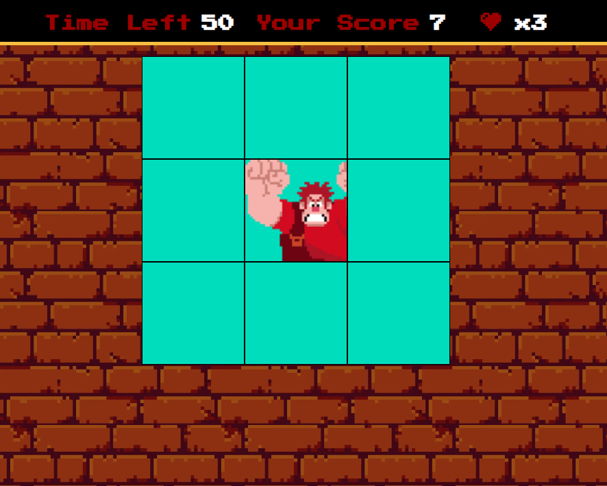

# Detona Ralph Game
>Desenvolvimento de Jogos - DIO

 

# Índice

* [1. Resumo do projeto](#1-resumo-do-projeto)
* [2. Deploy](#2-deploy)
* [3. Tecnologias Utilizadas](#3-tecnologias-utilizadas)

## 1. Resumo do projeto📝
Projeto desenvolvido para o curso de Desenvolvimento de Jogos com JavaScript da DIO em parceria com Ifood e Potencia Tech. Foi desenvolvido um jogo no qual o usuario deve clicar onde o inimigo (Ralph) está e conforme for acertando o inimigo, seu score (pontuação) aumenta, mas tem somente 60 segundos para alcançar o máximo de pontos possivel!

## 2. Deploy📝
### 📎[Acesse aqui](https://nicoletsingas.github.io/Detona-Ralph-Game/)

## 3. Tecnologias Utilizadas✅ 
    
